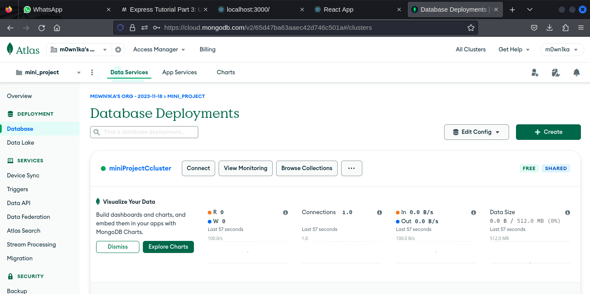

# resources
- https://developer.mozilla.org/en-US/docs/Learn/Server-side/Express_Nodejs/development_environment
- https://developer.mozilla.org/en-US/docs/Learn/Server-side/Express_Nodejs/mongoose
- install postman https://dev.to/titusnjuguna/3-easy-commands-to-install-postman-in-kali-linux-1307

## process
- npm init ->create a package.json
-  npm install express
- node index.js
- npm install -g nodemon
## database
- https://account.mongodb.com/account/login
- https://cloud.mongodb.com/v2/65d47ba63aaec42d746c501a#/clusters
- radhaminiprojectpass 

- npm install mongodb --save
## registraion feature
- create a model
- registraiton route
- insert into database
